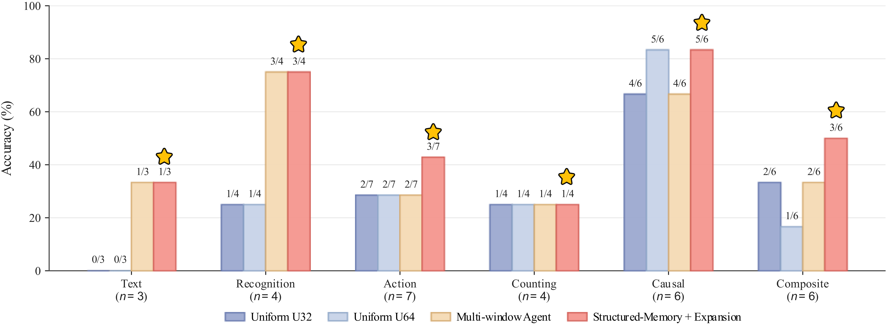

<h1 align="center">
  A Training-Free Long-Video Understanding Agent<br>
  with Structured Memory and Temporal Re-observation
</h1>

> **Important Note:** This repository provides the implementation of a training-free long-video QA agent built on a frozen Qwen3-VL model.  
> The framework is designed to locate sparse question-relevant evidence in long videos through structured segment memory, neighbor expansion, and local temporal re-observation, without model fine-tuning or a ready-made video-agent framework.

---

## Introduction

🌟 **Training-free long-video question answering**

Long videos often contain far more visual information than a multimodal model can process in a single pass. Uniform sampling provides broad coverage, but it may spend most of the visual budget on redundant or question-irrelevant frames while representing short-lived evidence with only an isolated observation.

This repository studies a different strategy: rather than uniformly increasing the number of sampled frames, the system organizes perception around the question. It first constructs reusable segment-level memory for each video, retrieves temporally relevant segments using the question and candidate answers, expands neighboring context to reduce boundary misses, and then returns to the original video for local visual observation.

The system is training-free: all methods use the same frozen Qwen3-VL-8B-Instruct checkpoint, and the differences come from how video observations, memory, retrieval, and tool calls are organized.

## Framework

<p align="center">
  
</p>

The framework contains an offline memory-construction stage and an online query-time reasoning stage:

- **Uniform Sampling Baselines:** sample 32 or 64 frames across the full video and perform one-shot question answering.
- **Multi-window Temporal Re-observation:** use coarse observations to select question-dependent temporal windows and reallocate the visual budget to those windows.
- **Structured Segment Memory:** divide each video into zero-based 60-second segments and store reusable structured records containing scenes, entities, actions, objects, visible text, counting cues, temporal cues, and retrieval keywords.
- **Question-aware Memory Retrieval:** retrieve a ranked set of seed segments using the question, answer options, and the memory bank of the current video.
- **Neighbor Expansion and Temporal Merging:** expand each seed to adjacent segments, clip the range to valid video boundaries, and merge overlapping segment groups.
- **Local Visual Re-observation:** sample original video frames from the merged temporal groups for fine-grained evidence acquisition.
- **Visual-grounded Final QA:** use the re-observed frames as the primary evidence, while retaining the selected memory records as auxiliary guidance for final multiple-choice prediction.

The core design principle: **structured memory determines where to look, neighbor expansion reduces temporal boundary misses, and the original local video frames provide the primary evidence for answering.**

---

## Main Results

Evaluation subset: **LVBench-30** (`data/manifests/lvbench_official_30_fixed.json`), containing 30 multiple-choice QA items sampled from three long LVBench videos. All methods use the same frozen Qwen3-VL-8B-Instruct base model.

| Method                            | Memory | Tool Use | Observation Strategy                  |      Accuracy      |
| :-------------------------------- | :----: | :------: | :------------------------------------ | :----------------: |
| Uniform U32                       |   ✗    |    ✗     | Uniform 32-frame sampling             |   10/30 (33.33%)   |
| Uniform U64                       |   ✗    |    ✗     | Uniform 64-frame sampling             |   10/30 (33.33%)   |
| Multi-window Agent                |   ✗    |    ✓     | Question-guided multi-window sampling |   13/30 (43.33%)   |
| **Structured-Memory + Expansion** |   ✓    |    ✓     | Memory-guided temporal re-observation | **16/30 (53.33%)** |

Uniform U32 and U64 achieve the same accuracy, showing that simply doubling the number of uniformly sampled frames does not improve performance on this subset. The Multi-window Agent improves accuracy through question-guided observation, while Structured-Memory + Expansion reaches the best result.

### Per-video Results

Videos A, B, and C correspond to the approximately 102-, 42-, and 35-minute videos, respectively. Each video contains ten questions.

| Method                            | Video A  | Video B  | Video C  |  Overall  |
| :-------------------------------- | :------: | :------: | :------: | :-------: |
| Uniform U32                       |   3/10   |   3/10   |   4/10   |   10/30   |
| Uniform U64                       |   4/10   |   3/10   |   3/10   |   10/30   |
| Multi-window Agent                |   2/10   |   5/10   | **6/10** |   13/30   |
| **Structured-Memory + Expansion** | **5/10** | **6/10** |   5/10   | **16/30** |

The final method performs best on Videos A and B, while the Multi-window Agent performs best on Video C. This indicates that the benefit of persistent structured memory varies across videos rather than uniformly dominating every question set.

### Question-type Results

The category labels below follow the question-type annotations used in the evaluation manifest.

| Question Type | Questions | Uniform U32 | Uniform U64 | Multi-window Agent | Structured-Memory + Expansion |
| :------------ | :-------: | :---------: | :---------: | :----------------: | :---------------------------: |
| Text          |     3     |     0/3     |     0/3     |      **1/3**       |            **1/3**            |
| Recognition   |     4     |     1/4     |     1/4     |      **3/4**       |            **3/4**            |
| Action        |     7     |     2/7     |     2/7     |        2/7         |            **3/7**            |
| Counting      |     4     |   **1/4**   |   **1/4**   |      **1/4**       |            **1/4**            |
| Causal        |     6     |     4/6     |   **5/6**   |        4/6         |            **5/6**            |
| Composite     |     6     |     2/6     |     1/6     |        2/6         |            **3/6**            |
| **Total**     |  **30**   |  **10/30**  |  **10/30**  |     **13/30**      |           **16/30**           |

The clearest gains appear in recognition, action, and composite questions. Text recognition and counting remain difficult, indicating that improved temporal localization does not fully solve fine-grained OCR or dense counting.

<p align="center">
  <a href="figs/question_type_accuracy.pdf">
    
  </a>
</p>

<p align="center">
  <b>Accuracy across question types.</b>
  Values above the bars report the number of correct predictions over the number of questions in each category.
</p>

The visualization makes the category-level differences more explicit: both agent variants provide the clearest gains on recognition questions, while Structured-Memory + Expansion further improves action and composite questions. Text recognition and counting remain difficult, showing that better temporal localization does not by itself solve fine-grained OCR or dense counting.

### Retrieval and Boundary Recovery

Expansion includes two neighboring segments on each side of every retrieved seed and merges overlapping temporal groups.

| Metric                       | Count |  Rate  |
| :--------------------------- | :---: | :----: |
| Seed retrieval hit           | 20/30 | 66.67% |
| Expanded temporal hit        | 25/30 | 83.33% |
| Recovered by expansion       | 5/30  | 16.67% |
| Correct with seed hit        | 12/30 | 40.00% |
| Correct with expanded hit    | 14/30 | 46.67% |
| Correct without expanded hit | 2/30  | 6.67%  |
| Final accuracy               | 16/30 | 53.33% |

Neighbor expansion raises temporal evidence coverage from 66.67% to 83.33%, recovering five cases that were missed by the initially retrieved seed segments. The gap between expanded hit rate and final accuracy shows that finding the correct interval is necessary but does not guarantee correct fine-grained visual reasoning.

---

## Repository Structure

```text
real-video-agent/
├── data/manifests/                         # Evaluation manifests, no videos
│   ├── lvbench_official_30_fixed.json
│   ├── lvbench_official_30_stats.json
│   └── official_30_by_video/
├── docs/                                   # Report materials and result notes
├── memory/README.md                        # Memory files are generated locally
├── outputs/README.md                       # Prediction outputs are generated locally
├── scripts/                                # Dataset, download, memory, evaluation utilities
└── src/                                    # Agent and baseline implementation
```

---

## Environment

Recommended environment used in the experiments:

- Python 3.10
- PyTorch with CUDA
- Qwen3-VL compatible `transformers`
- `decord`, `Pillow`, `datasets`, `huggingface_hub`

Install minimal dependencies:

```bash
pip install -r requirements.txt
```

The experiments were run with a local Qwen3-VL-8B-Instruct checkpoint. Set:

```bash
export MODEL_PATH=/root/Qwen3-VL-8B-Instruct
export VIDEO_ROOT=/root/LVBench/videos
export GPU=0
```

---

## Data Preparation

### 1. Build or reuse the official-30 manifest

The submitted repository already includes:

```text
data/manifests/lvbench_official_30_fixed.json
```

To rebuild from HuggingFace LVBench:

```bash
python scripts/build_lvbench_official_subset.py --hf-name lmms-lab/LVBench --split auto --video-root "$VIDEO_ROOT" --num-videos 3 --per-video 10 --seed 2026 --output data/manifests/lvbench_official_30.json

python scripts/fix_lvbench_manifest_options.py --input data/manifests/lvbench_official_30.json --output data/manifests/lvbench_official_30_fixed.json
```

### 2. Download required videos

The LVBench videos are stored in chunked zip files. The low-disk downloader only extracts videos needed by the manifest and removes the zip after scanning.

```bash
python scripts/download_lvbench_needed_videos_resumable.py --manifest data/manifests/lvbench_official_30_fixed.json --video-dir "$VIDEO_ROOT" --start 1 --end 14
```

If a mirror fails, set one endpoint explicitly:

```bash
export HF_ENDPOINT=https://hf-mirror.com
```

---

## Run Baselines

### U32

```bash
CUDA_VISIBLE_DEVICES=$GPU PYTHONPATH=. python src/baseline_u32.py --manifest data/manifests/lvbench_official_30_fixed.json --video-root "$VIDEO_ROOT" --model-path "$MODEL_PATH" --output outputs/preds/lvbench_u32_official_30.jsonl --num-frames 32 --image-size 448 --max-new-tokens 32 --dtype bf16 --limit 30
```

### U64

```bash
CUDA_VISIBLE_DEVICES=$GPU PYTHONPATH=. python src/baseline_u32.py --manifest data/manifests/lvbench_official_30_fixed.json --video-root "$VIDEO_ROOT" --model-path "$MODEL_PATH" --output outputs/preds/lvbench_u64_official_30.jsonl --num-frames 64 --image-size 448 --max-new-tokens 32 --dtype bf16 --limit 30
```

---

## Run Multi-window Agent without Memory

```bash
CUDA_VISIBLE_DEVICES=$GPU PYTHONPATH=. python src/agent32_multiwindow_wo_memory.py --manifest data/manifests/lvbench_official_30_fixed.json --video-root "$VIDEO_ROOT" --model-path "$MODEL_PATH" --output outputs/preds/lvbench_agent32_multiwindow_wo_memory_official_30.jsonl --coarse-frames 8 --windows 3 --frames-per-window 8 --image-size 448 --limit 30
```

---

## Build Structured Memory

Split the manifest by video:

```bash
python scripts/split_manifest_by_video.py --manifest data/manifests/lvbench_official_30_fixed.json --out-dir data/manifests/official_30_by_video
```

Build memory for each video:

```bash
bash scripts/run_build_memory_official30.sh
```

This creates:

```text
memory/lvbench_structured_segments_official_30/<video_key>_60s.json
```

Each segment stores structured fields: scene, characters, actions, objects, visible text, counting cues, temporal cues, and search keywords.

---

## Run StructuredMemory + Neighbor Expansion

```bash
bash scripts/run_expansion_official30.sh
```

This runs each video-specific manifest with its corresponding memory file, then merges the three JSONL files into:

```text
outputs/preds/lvbench_structured_memory_expand_official_30.jsonl
```

Analyze results:

```bash
python scripts/summarize_predictions.py --pred outputs/preds/lvbench_structured_memory_expand_official_30.jsonl

python scripts/analyze_expanded_segment_hit.py --manifest data/manifests/lvbench_official_30_fixed.json --pred outputs/preds/lvbench_structured_memory_expand_official_30.jsonl
```

---

## One-command Evaluation Helper

For convenience after videos and memory are ready:

```bash
bash scripts/run_official30_core_eval.sh
```

This runs U32, U64, Multi-window Agent, and summarizes all available predictions.

---

## AI Tool Usage

AI tools were used only as auxiliary support for code suggestions, debugging references, command organization, and language polishing. The overall system design, implementation decisions, experiment setup, execution, result checking, and analysis were completed and verified by the author.
